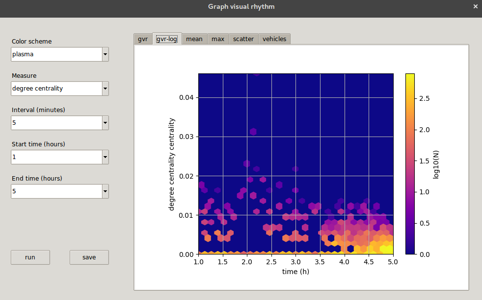
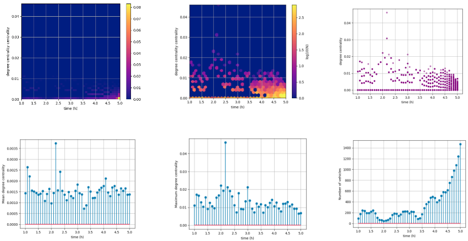

# Graph Visual Rhythm for Vehicular Networks 

### Dependencies:

Before the execution, you need to check these following dependencies: SUMO 1.2, python, python3, networkx, and matplotlib 2.1.0, seaborn.

### Dataset:

TAPASCologne is used.
You can download it in this link http://kolntrace.project.citi-lab.fr/ 

### Colecting data:

`python runner.py <cologne6to8>.sumocfg <tripinfo>.xml`

### Complex network measures:

`python graph.py`

#### List of measures available:

- Degree centrality
- Closeness centrality
- Betweenness centrality
- Local efficiency
- Harmonic centrality
- PageRank

### Interface:

`python3 interface.py`

### Output:

